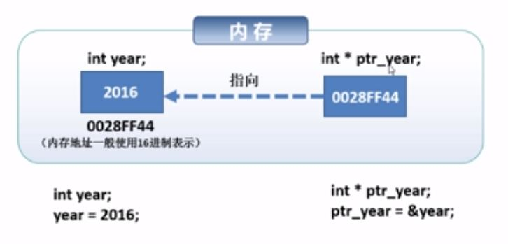

## 指针

- 指针是一个值为内存地址的变量（或数据对象）




- **ptr_year是int *类型的，存储的是内存地址**


### 基本用法：

`数据类型 * 指针变量名`

**不同类型的指针指向不同的数据类型**

> 例如：
> 
> ```python
> int * ptr_num = NULL;
> char * ptr_name = NULL;
> float * money_ptr = NULL;
> double * p_price = NULL;
> ```

注意：在头文件<stdio.h>中，NULL被定义为`int * ptr_num = NULL;`指针的初始值为空，表示指针不指向任何地址

**在定义的时候最好定义为NULL，否则就是野指针**


### 取地址&

```python
int num = 100;
printf("num变量的地址是： %p", &num);  //%p是指针占位符也就是指地址
int * p_num = NULL;
p_num = &num
//int * p_num = &num ;
int * p_num_2;
p_num_2 = p_num;  //两个指针全部指向同一个位置
```

### 间接运算符

```python
int num = 1024;
int * ptr_num;
ptr_num = &num ;

*ptr_num = 1111;   //根据ptr_num找到其对应的空间，改变其所指向的空间的值，相当于num = 1111
```


### 二级指针：指向指针的指针(int **)

```python
int num = 9;
int * ptr_num = &num ;  //ptr_num保存的是num的地址
int ** ptr_ptr_num = &ptr_num;   //ptr_ptr_num保存的是ptr_num的地址

**ptr_ptr_num = 1000;  //通过二级指针直接修改num的值

//同理，其他多级指针
```


### 指针小结

- 指针同样是一个变量，只不过该变量中存储的是另一个对象的内存地址

- 如果一个变量存储另一个对象的地址，则称该变量指向这个对象

- 指针变量可以赋值，指针的指向在程序执行中可以改变

**注意：**

1. 指针不能与现有的变量同名

2. 指针可存放C语言中的任何基本数据类型、数组和其他所有高级数据结构的地址

3. 若指针已声明为指向某种类型数据的地址，则它不能用于存储其他类型数据的地址

4. 应为指针指定一个地址之后，才能在语句中使用指针


