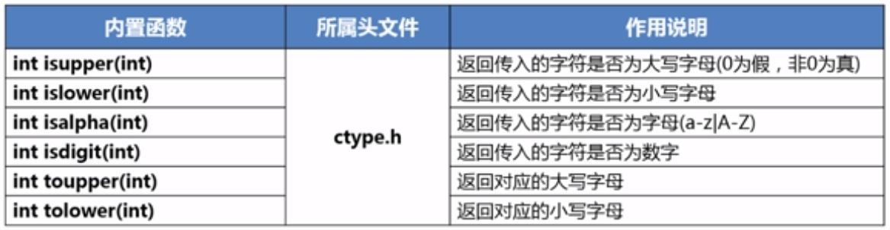
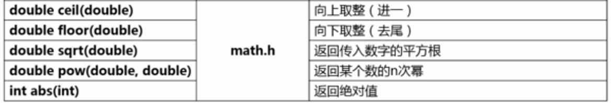

## 内置函数

### 1.ctype.h



**C语言中，0表示假，非0表示真**

函数的参数是**字符**，或者对应的**ASCI码**

`isdigit('a');  //等同于isdigit(97); 97是'a'的ASCII码`

### 2.math.h



power(2,3);  //2的3次方

### 3.stdlib.h


```python
#include <time.h>
srand(time(NULL));
```

```python
exit(0);  //0 - 正常退出
exit(错误码)；  //表示非正常退出，错误码可以系统或者自己决定
```

### 4.stdlib.h

有关堆内存分配的四个函数：**要记得free(p)，释放分配的内存空间**

**可以实现在堆上建立数组**

```python
    int * int_p = (int *)malloc(40);
    char * ch_p = calloc(10, sizeof(char));
    ch_p[2] = 'v';
    int i;
    for(i = 0; i< 10; i++){
        printf("int %d element is %d\n", i, int_p[i]);
    }

    for(i = 0; i< 10; i++){
        printf("char %d element is %c\n", i, ch_p[i]);
    }

    system("pause");

    ch_p = realloc(ch_p, 12 * sizeof(char));

    for(i = 0; i< 12; i++){
        printf("char %d element is %c\n", i, ch_p[i]);
    }

    free(int_p);
    int_p = NULL;
    free(ch_p);
    ch_p = NULL;
```

> **注意：calloc和malloc的作用类似**：
> 
> 但是：
> 
> 1. calloc不需要强制转换，直接返回内存空间
> 
> 2. calloc两个参数，默认初始化数组元素

- **malloc**  

  【函数原型】`void *malloc(size_t __size)`  

  【参数说明】`size` 需要分配的内存空间的大小，单位是字节。  

  【返回值类型】`void *` 表示未确定类型的指针，分配成功返回指向该内存的地址，失败则返回`NULL`。C、C++规定，`void *` 类型可以强制转换为任何其它类型的指针。  

  【函数功能】 表示向系统申请分配指定 size 个字节的内存空间。例如：

```
    int *a = malloc(4);  //申请4个字节的空间用于存放一个int类型的值
    char *b = malloc(2);  //申请2个字节的空间用于存放一个char类型的值
```

- **calloc**  

  【函数原型】`void *calloc(size_t __count, size_t __size)`  

  【参数说明】`count` 表示个数，`size` 单位个需要分配的内存空间的大小，单位是字节。  

  【返回值类型】`void *` 表示未确定类型的指针。例如：  

  【函数功能】 表示向系统申请分配 count 个长度为 size 一共为 count 乘以 size 个字节长度的连续内存空间，并将每一个字节都初始化为 0。

```
    int *c = calloc(10, sizeof(int)); 申请10个sizeof(int) 字节的空间
    char *d = calloc(2, sizeof(char)); 申请10个sizeof(char) 字节的空间
```

- **realloc**  

  【函数原型】`void *realloc(void *__ptr, size_t __size)`  

  【参数说明】`ptr` 表示需要修改的内存空间的地址，`size` 表示需要重写分配的内存空间的大小，单位是字节。  

  【返回值类型】`void *` 表示未确定类型的指针。  

  【函数功能】 表示更改已经配置好的内存空间到指定的大小。例如：

  如果原先的内存大小后面没有足够的空闲空间用来分配，那么从堆中另外找一块newsize大小的内存。 

  并把原来大小内存空间中的内容复制到newsize中。返回新的mem_address指针。（数据被移动了）。老块被放回堆上回收。

```
    char *d = calloc(2, sizeof(char));  //申请2个sizeof(char) 字节的空间
    char *f = realloc(d, 5 * sizeof(char));  //将原来变量d指向的2个sizeof(char) 字节的空间更改到5个sizeof(char) 字节的空间并由变量f指向。
```

- **free**  

  【函数原型】`void free(void *)`  

  【参数说明】`void *` 表示需要释放的内存空间对应的内存地址。  

  【返回值类型】返回值为空。  

  【函数功能】 表示用来释放已经动态分配的内存空间。`free()` 可以释放由 `malloc()`、`calloc()`、`realloc()` 分配的内存空间，以便其他程序再次使用。需要注意的是：`free()` 不会改变 传入的指针的值，调用 `free()` 后它仍然会指向相同的内存空间，但是此时该内存已无效，不能被使用。所以建议将释放完的指针设置为 `NULL`。例如：

```
    char *g = malloc(sizeof(char)); //申请sizeof(char)大小内存空间
    free(g);      //释放掉g指针指向的内存空间
    g = NULL;     //将g指针指向NULL
```

`free()`函数只能释放动态分配的内存，并不能释放任意分配的内存，比如：

```
    int h[10];    //在栈上申请的10乘以sizeof(int)大小的内存空间
    free(h);      //此处报错：不能释放栈上分配的空间
```

## void 指针类型

在系统提供的内存分配的4个库函数`malloc`、`calloc`、`recolloc`、`free`中，除了`free`的返回值为空外，其他三个函数的返回值均为`void *`类型，由于指针不是本文的重点，所以这里仅仅简单介绍一下关于**`void`指针类型**（即`void *`类型）。  
《C语言程序设计》一书中对`void`指针类型是这样解释的：

> C99（C语言的官方标准第二版）允许使用基类型为`void`的指针类型，可以定义一个基类型为`void`的指针变量，它不指向任何类型的数据。请注意：不要把 **“指向`void`类型”** 理解为能指向 **“任何的类型”** 的数据，而应该理解为 **“指向空类型”** 或者 **“不指向确定”** 的类型的数据。在将它的值赋给另一个指针变量时由系统对它进行类型转换，使之适合被赋值变量的类型。

例如下面的代码：

```
int main(int argc, const char * argv[]) {
    int a = 3;                   //定义a为整型变量
    int *p1 = &a;                //p1指向 int 型变量
    char *p2;                    //p2指向 char 型变量
    void *p3;                    //p3为无类型指针变量
    p3 = (void *)p1;             //将p1的值转换为void *类型，然后赋值给p3
    p2 = (char *)p3;             //将p3的值转换为char *类型，然后赋值给p2
    printf("%d\n", *p1);         //输出a的值 3
    p3 = &a;                    
    printf("%d", *p3);           //此处报错，p3无指向，不能指向a 
    return 0;
}
```

C99标准把上述三个函数的基类型定义为`void`类型，这种指针称之为**无类型指针**，即不指向哪一种具体的类型数据，只表示用来指向一个抽象类型的数据，仅仅提供一个纯地址，不能指向任何具体的对象。

作者：老板娘来盘一血  
链接：https://www.jianshu.com/p/b2380e47d005  
來源：简书  
简书著作权归作者所有，任何形式的转载都请联系作者获得授权并注明出处。

### string.h


