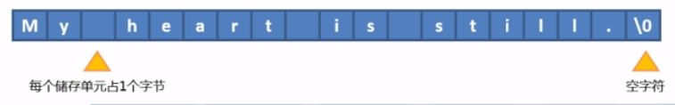

# 字符串

- 理解字符串常量

- 理解字符数组和字符串的异同

- 使用字符串输入输出函数

- 使用字符串处理函数

- 理解指针和字符串的关系

- 使用字符指针数组

- 使用字符串作为函数参考

## 1.C语言中的字符串

字符串:

- 一个或多个字符的序列称为字符串

- C语言中“My heart is still."

- **双引号不是字符串的一部分，仅用来告诉编译器括起来的是字符串**

- C语言的字符串**使用字符数组进行存储**

- **每个存储单元占一个字节，结尾一定是空字符`'\0'`(ASCII码为0)**

- **注意：空字符不要和NULL混淆。空字符是字符串的终止符，而NULL是一个符号，表示不引用任何内容的内存地址**



### 1.1 字符串和字符数组

```c
int main() {
    //字符串和字符数组的区别：最后一位是否是空字符
    //所有的字符串都是字符数组
    //以'\0'结尾的字符数组才是字符串
    char name1[] = {'J', 'a', 'c', 'k', '\0'};
    char name2[] = {"Jack"};    //字符串赋值默认把最后一位作为空字符

    printf("Array size is %d\n", sizeof(name1));
    printf("String size is %d\n", sizeof(name2));
    return 0;
}
```

**注意：**

**声明存储字符串的数组时，数组大小至少比所存储的字符数多1**，因为编译器会自动在字符串常量的末尾添加空字符'\0'.

**动态录入：**

```c
int main(){
    char words[10];
    printf("请输入名称：");
    scanf("%s", words);
    //问题：如果你输入超过10个字符，下面的printf会把所有的字符输出，也就是把所有的字符保存到内存中，这是绝对不允许的。
    //确保输入的字符串不越界，可以
    //scanf("%10s", words);
    //注意这里words[10]并不会强制字符串最后一位是'\0'
    printf("%s\n",words);
}
```

### 1.2 gets/puts/fgets

gets(): **scanf输入字符串可以配合%s格式，但缺点是当遇到字符串中有空白或tab字符时，会自动视为串输入结束， ，并且会将结束符\0录入到字符串中**。因此不适合输入包含空白/tab字符的字符串。这时gets()函数就可解决该问题。

```c
int main(){
    char words1[50];
    char words2[50];
    printf("Input words");
    gets(words1);               //gets不会进行越界检查，也无法限制输入的数量，所以尽量不用，改用fgets
    gets(words2);
    puts("***************");    //puts会自动换行
    puts(words1);
    puts(words2);
    return 0;
}
```

**注意：**

1. gets函数不对接受的字符串的buffer进行边界检测，会造成越界，从而产生Bug

2. 可以使用`fget(words1, 20, stdin);`代替gets，20表示最多输入20-1个字符

**gets不会进行越界检查，也无法限制输入的数量，所以尽量不用，改用fgets**

**fgets函数**

- 需要头文件`#include <string.h>`

- 函数原型：`char *fgets(char *buf, int bufsize, FILE *stream);`

- 需要注意的是：

```c
char name[10];
fgets(name, 10, stdin);
//如果实际输入小于9，会自动添加一个换行符在尾部，abcd -> abcd\n
//如果实际输入9或者大于9，取前9个字符并将最后一个设为\0，ascdefghijk -> abcdefgij\0
```

### 1.3 字符串小结

- 字符串是一个或多个字符组成的序列

- C语言中使用字符数组存储字符串

- 所有的字符串都是字符数组，反之不成立

- 三种方式录入字符串

  ```c
  scanf("%s", str);
  gets(str);
  fgets(str, 50, stdin);
  ```

### 1.4 字符串操作：查看源码


| 内置函数                                        | 头文件      | 作用说明                                                           |
| ------------------------------------------- | -------- | -------------------------------------------------------------- |
| char *strchr(const char *s,char c)          | string.h | 查找字符串s中首次出现字符c的位置。                                             |
| char *strstr(char *str1, const char *str2); | string.h | 函数用于判断字符串str2是否是str1的子串。如果是，则该函数返回str2在str1中首次出现的地址；否则，返回NULL。 |

1. **strlen**

   - 计算字符串的实际长度，**不包含字符串结束标志\0**

   - **计算的是到第一个结束标志`\0`的长度**

2. 字符串复制**strcpy**

   - 把源字符数组中的字符串复制到目的字符数组中，直到遇到**源字符数组中的第一个结束符\0**，**连同结束标志\0一同复制**

   - 数组的复制原理：每个元素逐个进行复制

   - 注意复制的过程中如果源字符数组没有`'\0'`可能会造成数组越界

   ```c
   int main() {
       //字符串和字符数组的区别：最后一位是否是空字符
       //所有的字符串都是字符数组
       //以'\0'结尾的字符数组才是字符串
   
       char word1[15] = "Hello world!";
       char word2[20];
       printf("%s\n", word2);
       printf("Input Spring\n");
       getString(word2, 20);                        //输入 - abc
   
       strcpy(word1, word2);                        //word2 = abc\0
                                                    //word1 = abc\0o world1\0, 替换原来的Hell
   
       printf("%s\t%s\n", word1, word2);            //输出为： abc    abc
                                                    //因为printf遇到\0结束输出
   
       return 0;
   }
   
   void getString(char str[], int count){
       //去除fget函数可能添加的\n
   
       //使用fgets函数接收字符串，使用\0替换字符数组的最后一位\n
       fgets(str, count, stdin);
       //查找\n
       char * find = strchr(str, '\n');            //str函数用来查找第一次出现目标字符的位置
   
       if(find)
           *find = '\0';
   }
   ```

3. 字符串比较strcmp

   - 将两个字符串从首字符开始，按照ASCII码进行比较大小，直到出现不同的字符或者两个字符都是\0

     - 字符串1 == 字符串2，返回0

     - 字符串1 <   字符串2， 返回正数

     - 字符串1  >   字符串2，返回负数

4. 字符串拼接strcat(dest, src)

   - src拼接到dest后面，这就**要求dest一定要足够大**

   - 把src所指向的字符串（包括“\0”）复制到dest所指向的字符串**首个\0**后面（删除\*dest原来首个的“\0”）。要保证\*dest足够长，以容纳被复制进来的*src。*src中原有的字符不变。返回指向dest的[指针](https://baike.baidu.com/item/%E6%8C%87%E9%92%88)。

   ```c
   //源码
   #include <string.h>
   #undef strcat
   #ifndef STRCAT
   #define STRCAT strcat
   
   #endif
   /* Append SRC on the end of DEST.  */
   char *
   STRCAT (char *dest, const char *src)
   {
     strcpy (dest + strlen (dest), src);
     return dest;
   }
   ```

   ```c
   int main(){
       char str1[50] = "zzzz\0xxxxxcccccvvvvv";
   
       char str2[10] = "asc\0defg";
   
       strcat(str1, str2);
       printf("%s", str1);
       //zzzasc
   }
   ```

5. 字符串查找strchr(src, c)

   查找字符串src中首次出现字符c的位置。**返回首次出现_Val的位置的指针**，返回的地址是被查找字符串指针开始的第一个与Val相同字符的指针，**查找到结束符‘/0’为止**，**如果Str中不存在Val则返回NULL**。

   ```c
   void getString(char str[], int count){
    //去除fget函数可能添加的\n
    //使用fgets函数接收字符串，使用\0替换字符数组的最后一位\n
    fgets(str, count, stdin);
    //查找\n
    char * find = strchr(str, '\n'); //str函数用来查找第一次出现目标字符的位置
    if(find)
        *find = '\0';
    }
   ```

6. 查找子字符串strstr(str1, str2)

   strstr(str1,str2) 函数用于判断字符串str2是否是str1的子串。**如果是，则该函数返回str2在str1中首次出现的地址；否则，返回NULL。**

### 1.5 指向字符串的指针

- 将**指针指向字符串**

  - 可以指向常量字符串  `char * words = "My heart is still.";` 把右边字符串的首地址赋值给左边的字符指针，**字符串保存在常量区。**

    ```c
    char * words = "My heart is still.";
    words += 9;  //这里指针可以移动，如果 char words[] = "My heart is still."; 数组名作为常量指针不能移动
    puts(words); //输出is still.
    ```

  - 也可以指向存储字符串的字符数组

    ```c
    char name[10] = "Jack";
    char * p_name = name;
    ```

- 数组形式和执行形式的不同

  - **初始化字符数组时会把静态存储区的字符拷贝到数组中**

    `char name[10] = {'J', 'a', 'c', 'k', 's', 'o', 'n'};`

    `char name[10] = "Jackson";`

  - **初始化指针时只把字符串的地址拷贝到指针**

    `char * p_name = "Jackson";`
